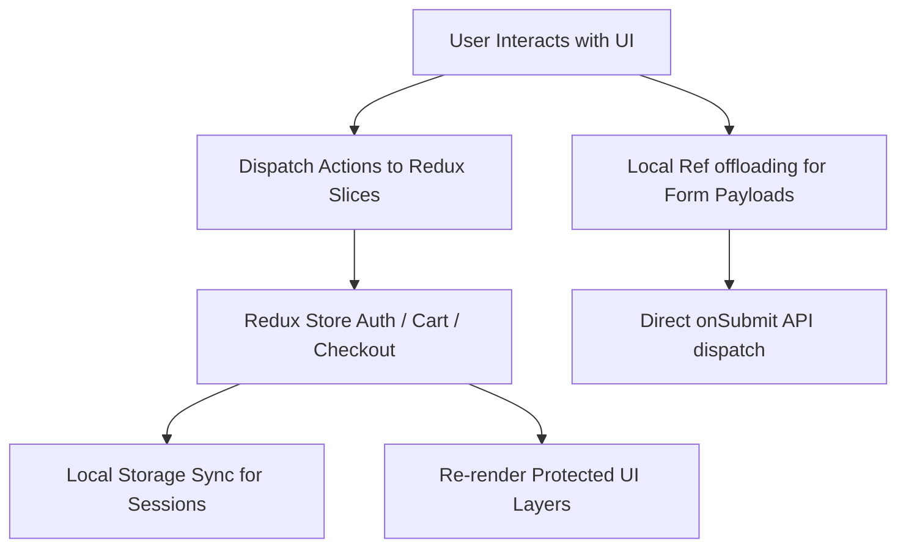

# Crunchy Cashew — Enterprise E-Commerce Platform Documentation

A high-performance, full-stack enterprise e-commerce platform engineered with a Next.js (App Router) frontend UI and an Express.js backend REST API, backed by a persistent MongoDB data store.

---

## 📁 System Repository Structure

The workspace is organized into two distinct service modules:

```text
Crunchy-Cashew-Web/
├── frontend-next/      # Next.js Frontend UI (React 19, TypeScript, Redux, Tailwind v4)
└── backend-node/       # Express.js REST API Engine & Database Layer
```

---

## 💻 Frontend Architecture & UI Documentation

The frontend module is built on a modern Next.js architecture leveraging React Server Components (RSC) and Client Components with strict type-safety, efficient client state propagation, and premium performance engineering.

### 🛠️ Core Technology Stack
- **Framework:** Next.js (App Router)
- **Runtime Environment:** React 19.2 (enhanced render cycles)
- **Language:** TypeScript (strict mode enabled)
- **Styling:** Tailwind CSS v4 (using native CSS-based directives)
- **State Management:** Redux Toolkit (RTK)
- **Animation Framework:** Framer Motion (configured for prefers-reduced-motion user access)

---

### 1. State Management & Data Flow Architecture

Client-side application state is orchestrated using Redux Toolkit combined with localized React state hooks.



#### Client State Slices
- **Auth Slice:** Tracks user session status, credentials, and verification tokens. Synchronizes securely with `localStorage` to ensure persistence across reloads.
- **Cart Slice:** Manages shopping cart items, prices, items quantities, and persistent caching.
- **Checkout Slice:** Holds transient checkout states, active pincode eligibility, and Razorpay transaction IDs.

#### State Best Practices
- **Functional Updaters:** State changes on forms utilize functional callbacks `setState(prev => ({ ...prev, [field]: value }))` to guarantee absolute synchronization with the latest scheduler batch and eliminate stale closure bugs.
- **State-to-Ref Offloading:** Elements that don't directly participate in JSX layout painting (such as non-rendered cover image files selected in file inputs) are routed to a `useRef` container rather than `useState`. This prevents heavy page components from triggering unnecessary re-render passes during attachment selection.

---

### 2. Rendering, Caching, & Hydration Strategies

To maximize Search Engine Optimization (SEO) and user experience speed, a hybrid rendering model is utilized:

#### Pre-rendering & Static Compilation
- **Static Pages (SSG):** Marketing landing pages, about pages, and documentation articles are pre-rendered at compile time to static HTML.
- **Incremental Static Regeneration (ISR):** Blog pages and product detail screens are configured with dynamic static routes, updated on demand or via a cron revalidation API endpoint (`/api/cron/revalidate`).

#### Hydration Mismatch Handling
- Date strings, localized currencies, and client-only items (such as relative timestamps) use strict `suppressHydrationWarning` markers or are delayed to a secure `useEffect` mount transition. This completely eliminates React hydration discrepancy notices between the server-rendered markup and the client runtime reconciliation.

#### Client Caching & Performance Tuning
- **IntersectionObserver Resource Cleanups:** Carousel animations and complex CSS planes (such as background parallax triggers) utilize `IntersectionObserver` bindings. Active timers, timeouts, and animation cycles are stored in local buffers and explicitly garbage-collected on hook cleanup (`unmount`) to ensure zero background CPU consumption.
- **Video Autoplay Fallbacks:** Video-intensive zones like the `HeroAnimationBanner` employ progressive rendering fallbacks. An high-quality asset `animation-photo.png` serves as a background fallback. Event listeners (`onPlay`, `onError`) gracefully fade the placeholder image out when hardware acceleration starts playing the video, or holds it solid on mobile low-power or slow connection restrictions.
- **Hoisted Component Modules:** Deep overlays and popups (e.g. `VideoPopup` inside `InstaVideos`) are hoisted to module scope rather than being declared nested inside parent render scopes. This prevents React from generating fresh component reference allocations on every frame.
- **Stable Reconciliation Keys:** Iterative maps avoid utilizing numerical index arrays as keys (`key={i}`). Elements use unique string tokens (`key="skeleton-1"`, `key={item.id}`) to guarantee that React's reconciliation engine tracks domestic changes perfectly without unmounting subtrees.

---

## 📡 Backend REST API Specifications

The server engine runs on Express.js and handles data modeling, user sessions, Razorpay financial handshakes, and administrative operations.

**Base URL Context:** `http://localhost:8000`

---

### 🔑 Authentication Services — `/api/auth`

All private endpoints require a Bearer token transmitted via the standard HTTP headers:
`Authorization: Bearer <jwt_token>`

| Method | Endpoint | Access Level | Purpose |
|:---|:---|:---|:---|
| `POST` | `/api/auth/register` | Public | Registers a new account profile |
| `POST` | `/api/auth/login` | Public | Authenticates credentials and yields JWT token |
| `POST` | `/api/auth/google` | Public | Handshakes OAuth sign-in tokens |
| `GET` | `/api/auth/me` | Logged In | Resolves authenticated user record |
| `PUT` | `/api/auth/profile` | Logged In | Modifies shipping records, names, or passwords |
| `POST` | `/api/auth/liked_products/:product_id` | Logged In | Appends item ID to the user wishlist array |
| `DELETE` | `/api/auth/liked_products/:product_id` | Logged In | Evicts item ID from the user wishlist array |

---

### 📦 Product Inventory Management — `/api/products`

| Method | Endpoint | Access Level | Purpose |
|:---|:---|:---|:---|
| `GET` | `/api/products/` | Public | Retrieves catalog list (supports filters/sorting) |
| `GET` | `/api/products/:id` | Public | Fetches detailed model of a single product |
| `POST` | `/api/products/` | Administrator | Adds a new product record to the database |
| `PUT` | `/api/products/:id` | Administrator | Modifies existing product values |
| `DELETE` | `/api/products/:id` | Administrator | Erases a product permanently |

#### Catalog Query Filters (`GET /api/products/`)
- `category` (String filter matching target categories)
- `search` (Full-text query targeting title names)
- `sort` (Accepts `price_asc`, `price_desc`, `newest`)

---

### 🛒 Checkout & Order Fulfillment — `/api/orders`

| Method | Endpoint | Access Level | Purpose |
|:---|:---|:---|:---|
| `POST` | `/api/orders/` | Logged In | Submits order data and generates payment intents |
| `GET` | `/api/orders/my-orders` | Logged In | Fetches purchase records for the current user |
| `GET` | `/api/orders/track/:order_id` | Public | Pulls tracking history with verification check |
| `POST` | `/api/orders/verify` | Logged In | Validates cryptographic Razorpay signatures |
| `PUT` | `/api/orders/cancel/:order_id` | Logged In | Cancels a transaction and triggers restock |

#### Razorpay Hook Handler (`POST /api/orders/verify`)
Verifies HMAC-SHA256 signature calculated from order details, validating payment status:
```json
{
  "razorpay_order_id": "order_Fh8j3kLw4n89bV",
  "razorpay_payment_id": "pay_Gy9s5mPx8z12hY",
  "razorpay_signature": "cryptographic_hash_from_payment_provider",
  "order_id": "mongodb_order_object_id"
}
```

---

### 📍 Logistics & Pincodes — `/api/pincodes`

| Method | Endpoint | Access Level | Purpose |
|:---|:---|:---|:---|
| `GET` | `/api/pincodes/` | Public | Lists all deliverable area codes |
| `POST` | `/api/pincodes/check` | Public | Checks if shipping is supported in a target code |
| `POST` | `/api/pincodes/admin/add` | Administrator | Configures a new supported deliverable code |
| `DELETE` | `/api/pincodes/admin/remove/:pincode` | Administrator | Revokes support for a pincode |

---

### 📬 CRM, Forms & Interactions — `/api/contact`

| Method | Endpoint | Access Level | Purpose |
|:---|:---|:---|:---|
| `POST` | `/api/contact/enquiry` | Public | Receives general business query forms |
| `POST` | `/api/contact/visit` | Public | Schedules institutional factory visit queries |
| `GET` | `/api/contact/enquiries` | Administrator | Fetches global list of queries |
| `GET` | `/api/contact/visits` | Administrator | Fetches global factory visit logs |

---

### 📝 CMS System Content — `/api/cms`

Supports the website's dynamic promotional content blocks:

| Method | Endpoint | Access Level | Purpose |
|:---|:---|:---|:---|
| `GET` | `/api/cms/banners` | Public | Lists active homepage promotion assets |
| `POST` | `/api/cms/admin/banners` | Administrator | Uploads promotional banners via Multi-part |
| `GET` | `/api/cms/blogs` | Public | Lists published blog and culinary articles |
| `POST` | `/api/cms/admin/blogs` | Administrator | Creates an article with attached cover art |
| `GET` | `/api/cms/testimonials` | Public | Displays verified customer review sliders |
| `PATCH` | `/api/cms/admin/testimonials/:id/approve` | Administrator | Moderates and verifies customer testimonial posts |

---

## 🗄️ Database Collection Structures (MongoDB)

| Collection | Schema Description & Index Strategies |
|:---|:---|
| `users` | Contains profile credentials, verification hash, address models, and role parameters. Indexed on `email` (unique). |
| `products` | Product parameters, categories, stock limits, and image URLs. Indexed on `category` and `name` (text index). |
| `orders` | Transaction histories, order status, Razorpay details, and shipping records. Indexed on `customer.phone`. |
| `pincodes` | Delivery coverage data. Contains deliverable pincode models. Indexed on `pincode` (unique). |
| `contacts` | CRM interaction entries and tour records. |
| `blogs` | Rich-text dynamic pages, SEO slugs, and authors. Indexed on `slug` (unique). |
| `testimonials` | Customer reviews, status, ratings, and approval markers. |
| `site_traffic` | Analytical records tracking request counts, daily users, and visit metadata. |

---

## 🔒 Platform Error Standard

Standardized API errors return a standard JSON model:
```json
{
  "detail": "Descriptive reason detailing the error transaction block"
}
```

### Response Code Dictionary
- `400` — Validation mismatch / Required arguments absent.
- `401` — Token invalid, expired, or absent.
- `403` — Authentication role insufficient for target access level.
- `404` — Resource or record not found in data collections.
- `500` — Server thread exception (yields trace log locally).

---

## 🚀 Environment Configuration & Startup

### Prerequisites
- Node.js (v18 or higher)
- MongoDB Database Instance (local or cloud-hosted)

### Environment Variables (`backend-node/.env`)
Copy `.env.example` configurations and specify the following variables:
```ini
MONGO_URI=mongodb+srv://<user>:<password>@cluster.mongodb.net
DATABASE_NAME=ecommerceDB
JWT_SECRET=super_secure_key_for_jsonwebtoken_signing
PORT=8000
RAZORPAY_KEY_ID=rzp_live_xxxxxxxx
RAZORPAY_KEY_SECRET=xxxxxxxxxxxxxxxxxxxxxxxx
CLOUDINARY_CLOUD_NAME=cloudinary_storage_cloud_name
CLOUDINARY_API_KEY=1234567890
CLOUDINARY_API_SECRET=xxxxxxxxxxxxxxxxxxxxx
```

### Installation Steps

1. **Clone and Install Dependencies:**
   ```bash
   # Initialize Backend services
   cd backend-node
   npm install

   # Initialize Frontend framework
   cd ../frontend-next
   npm install
   ```

2. **Run in Development Mode:**
   ```bash
   # In backend-node directory
   npm run dev

   # In frontend-next directory
   npm run dev
   ```

3. **Verify Build Stability:**
   Ensure production bundles build correctly prior to deployment:
   ```bash
   cd frontend-next
   npm run build
   ```
